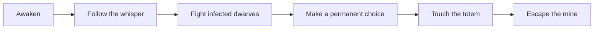
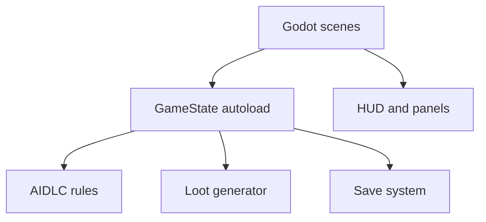
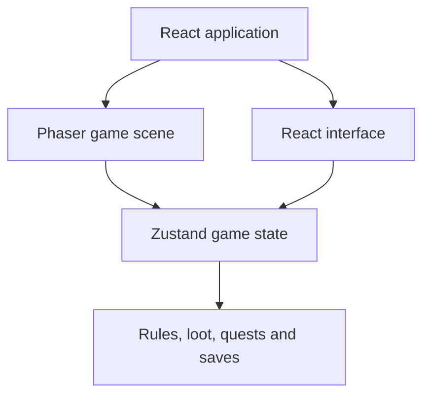
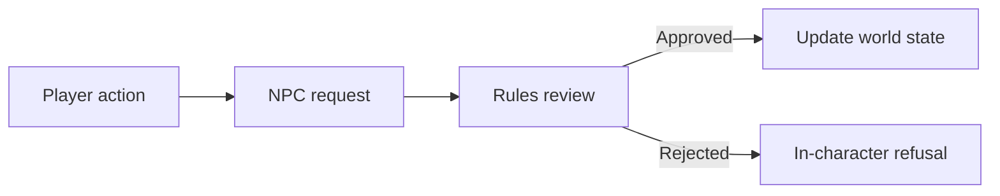

# Tides of Khah · 潮蚀之环

### Escape the mine. Carry the corruption with you.


**Tides of Khah** is a top-down dark fantasy action RPG prototype set in a world consumed by the Black Tide. Explore corrupted ruins, fight infected creatures, recover procedurally generated loot, and make permanent choices that reshape the world state.

The current vertical slice begins in the **Black Tide Mine**, where the player awakens without a memory and hears the voice of Khah—the ancient plague sealed beneath the old kingdom.

[Game design](GAME_DESIGN.md) · [Technical architecture](TECH_ARCHITECTURE.md) · [Godot project guide](godot/README.md)

> This repository contains a playable first-area prototype, not the complete game. The larger world, AI-driven NPC system, dungeons, factions, and endings are documented design goals.

---

## The First Descent

You wake beneath a dead mining settlement. Purple-skinned dwarves patrol the tunnels, a broken totem calls from the dark, and an injured survivor forces the first irreversible decision.

The opening slice includes:

- Character creation with a player-defined name
- A playable top-down mine environment
- Movement, melee attacks, dodge rolls, health, and stamina
- Corrupted dwarf enemies with pursuit and contact attacks
- Khah's scripted whispers and environmental storytelling
- An injured dwarf with a permanent three-way choice
- A totem-fragment vision and vessel awakening event
- Gold and random-affix equipment drops
- Inventory, quest, event-log, dialogue, and HUD systems
- Local world-state persistence in the web prototype
- A rules-based AIDLC state-change approval foundation

## Controls

| Input | Action |
|---|---|
| `WASD` or arrow keys | Move |
| `J` | Attack |
| `Space` | Dodge roll |
| `E` | Interact |

## Opening Gameplay Loop



The prototype ends at the mine exit. Grey Lantern Town is planned as the next area.

---

## Two Playable Implementations

The project began as a browser-first React and Phaser prototype and was later ported to Godot 4. Both implementations remain in the repository.

| Version | Location | Purpose |
|---|---|---|
| **Godot 4** | `godot/` | Current engine direction for a standalone 2D game |
| **Phaser + React** | repository root and `src/` | Original browser prototype and gameplay reference |

### Godot Architecture



The Godot port uses `CharacterBody2D`, scenes, signals, and autoload singletons to replace Phaser physics, React UI events, and Zustand state.

### Browser Architecture



Phaser owns movement, collision, combat, enemies, interactions, and rendering. React owns character creation, dialogue, choices, inventory, quests, logs, and the HUD.

---

## Run the Browser Prototype

### Prerequisites

- Node.js 20+
- npm

```bash
git clone https://github.com/hannnnnnnny/RPG-Game.git
cd RPG-Game
npm install
npm run dev
```

Open:

```text
http://127.0.0.1:5173
```

If PowerShell blocks `npm.ps1`, use:

```powershell
npm.cmd install
npm.cmd run dev
```

Create a production build with:

```bash
npm run build
npm run preview
```

---

## Run the Godot Version

1. Download the **Godot 4.3+ Standard** edition.
2. Open the Godot Project Manager.
3. Select **Import** and choose `godot/project.godot`.
4. Wait for the assets to finish importing.
5. Press `F5` to run the game.

The Godot version includes the character creator, mine scene, combat, enemies, interactions, HUD, dialogue, permanent choice, vision overlay, loot generation, and core world-state systems.

See [`godot/README.md`](godot/README.md) for project structure, autoload order, current placeholders, and engine-specific development notes.

---

## Core Systems

### Permanent World State

Choices update structured values such as:

```text
sanity · corruption · vessel awakening · world tier · story flags
```

The first injured-dwarf encounter is not cosmetic: saving, abandoning, or killing him changes the persistent state used by later story and faction rules.

### AIDLC Rule Foundation

**AIDLC** means *AI-Driven Living Characters*. The long-term idea is for NPCs to remember the player's actions and respond dynamically without allowing an AI model to break fixed story rules.



The current prototype implements the approval structure and scripted character events. A live LLM-powered NPC backend is a future integration, not a current feature.

### Loot and Progression

Enemies can drop gold and equipment assembled from rarity, item power, slot, and random affixes. The wider design proposes six equipment qualities, five world tiers, build archetypes, upgrading, reforging, and corruption mechanics.

### Dark Atmosphere

The Godot version uses 2D lighting, a player-carried mine light, coloured environmental lights, and a post-processing shader. Screen-edge corruption can intensify with the player's world-state value.

---

## Tech Stack

| Area | Technology |
|---|---|
| Current engine direction | Godot 4.3+, GDScript |
| Browser game | Phaser 3.86 |
| Web interface | React 18, TypeScript |
| State management | Zustand |
| Tooling | Vite 8, Playwright |
| Persistence | Browser local storage / Godot save foundation |
| Art direction | Programmatic pixel placeholders and character artwork |

## Repository Structure

```text
RPG-Game/
├── godot/                    # Godot 4 playable port
│   ├── scenes/               # Main, world, actor and UI scenes
│   ├── scripts/              # Core systems, actors, world and UI
│   └── assets/               # Characters, sprites, textures and shaders
├── src/                      # Phaser + React browser prototype
│   ├── app/                  # Application shell and character creation
│   ├── game/                 # Phaser scene and combat
│   ├── core/                 # World rules, loot and domain logic
│   ├── store/                # Zustand state
│   └── ui/                   # HUD, dialogue, inventory and logs
├── public/assets/            # Browser assets
├── GAME_DESIGN.md            # World, characters, systems and endings
├── TECH_ARCHITECTURE.md       # Browser architecture and AI boundaries
└── godot-migration/          # Phaser-to-Godot migration reference
```

---

## Design Vision

The full design document describes a much larger dark-fantasy ARPG:

- Eight main endings and additional hidden branches
- Seven factions with competing interpretations of the Black Tide
- Thirteen rift dungeons with distinct bosses and loot identities
- Sanity, corruption, parasitic power, and vessel-awakening systems
- Eight planned combat archetypes
- NPC facts, emotions, and story memories
- A fixed main narrative protected from uncontrolled AI generation

These systems are the roadmap for the game and should not be interpreted as complete playable content.

## Roadmap

- Replace programmatic placeholder sprites and tiles with production assets
- Add sound effects, music, and stronger combat feedback
- Complete and verify Godot save triggers and UI panels
- Build Grey Lantern Town as the second playable area
- Expand enemies, equipment, affixes, and boss encounters
- Add automated checks for the Godot project
- Prototype a constrained AI dialogue service behind the AIDLC rules layer
- Prepare desktop exports and evaluate a future Steam build

## Verification

For the browser prototype:

```bash
npm run build
npm audit --omit=optional
```

The browser slice has also been exercised with Playwright across character creation, scene loading, the permanent choice, totem interaction, equipment drops, and event-log updates.

For the Godot version, import `godot/project.godot`, confirm the configured autoloads, and run the project with `F5`.

---

Created by [Harry Han](https://github.com/hannnnnnnny).
