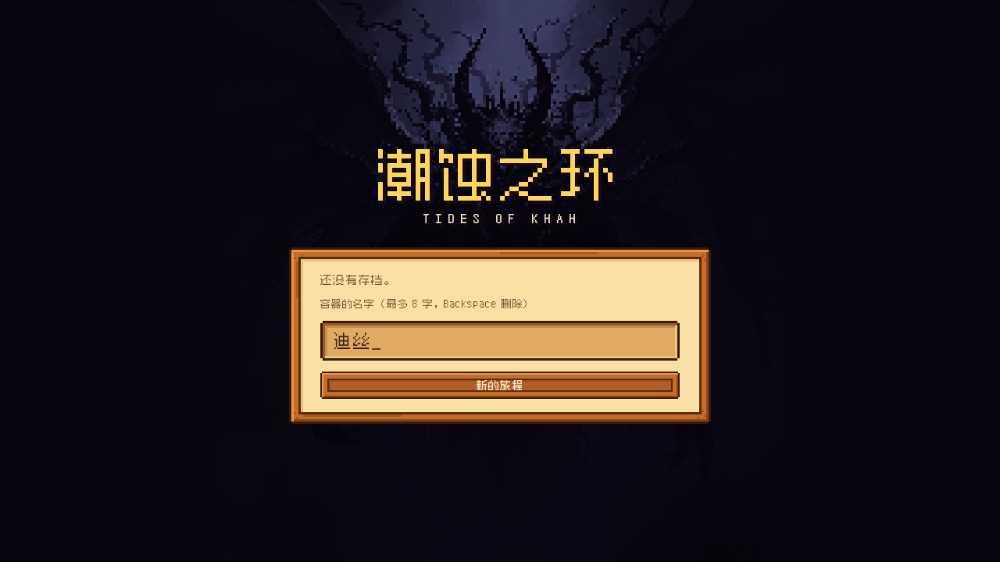
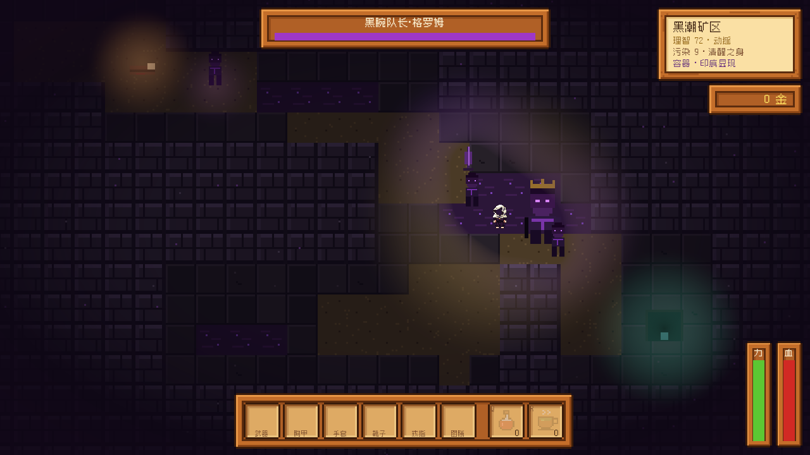
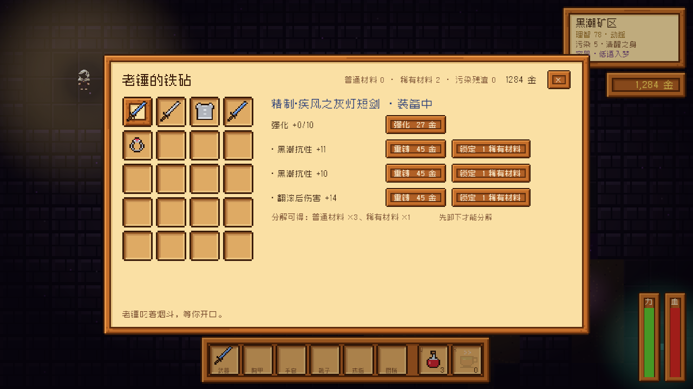
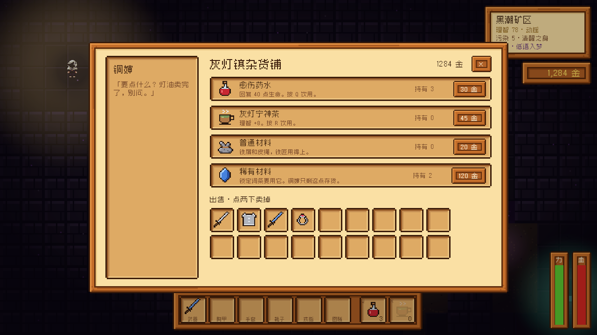
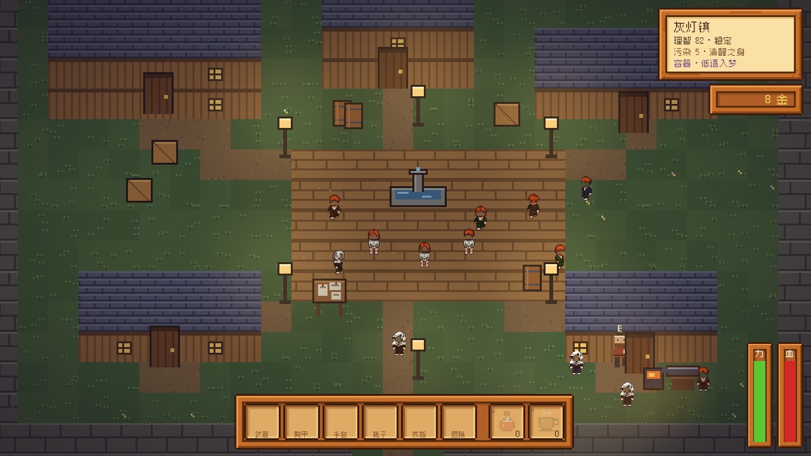
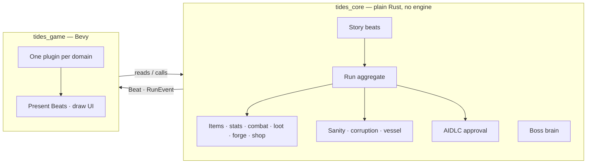
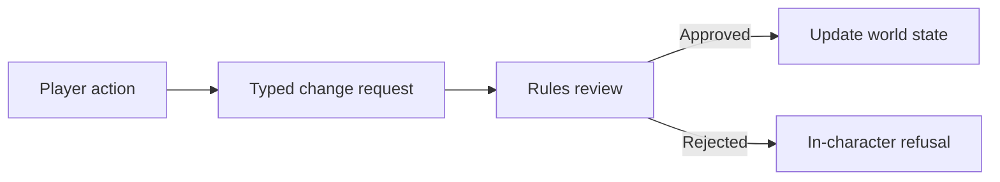

# Tides of Khah · 潮蚀之环

### Escape the mine. Carry the corruption with you.


**Tides of Khah** is a top-down dark fantasy action RPG set in a world consumed by the Black Tide. Fight infected dwarves, make permanent choices, forge your gear, and try to stay sane while Khah — the ancient plague sealed beneath the old kingdom — whispers that you already belong to the sea.

The game is written in **Rust with Bevy 0.19**, styled after *Stardew Valley*'s cosy wooden UI, and runs natively or in the browser.

[Game design](GAME_DESIGN.md) · [Technical architecture](TECH_ARCHITECTURE.md) · [Credits](game/CREDITS.md)

> This is a playable vertical slice — two areas and one boss — not the complete game. The wider world, factions, dungeons and endings are documented design goals.



---

## What You Can Play

**黑潮矿区 · The Black Tide Mine** — wake without a memory beneath a dead mining settlement.

- Move, sprint, dodge-roll and aim melee swings with the mouse
- Corrupted dwarves that hunt you in the dark; a light you carry with you
- An injured dwarf and your first **permanent** choice: save him, abandon him, or end him
- A totem-fragment vision, then **黑腕队长·格罗姆** — a two-phase boss with telegraphed slams, lunges and summons
- Death costs gold, never gear; you rise again at the last checkpoint



**灰灯镇 · Grey Lantern Town** — the last place where the lamps still burn.

- Twelve townsfolk who wander, sit and talk; the gate warden reads your corruption before letting you in
- **老锤's anvil** — upgrade gear to +10, reroll a single affix (keep or take the offer), lock an affix, or salvage for materials
- **铜婶's general store** — buy healing draughts, calming tea and materials; sell gear you no longer wear
- If you saved him, **布林** the dwarf limps after you through the mine and waits by the forge in town

| Forge | Shop |
|---|---|
|  |  |



Around all of it: sanity and corruption meters with named tiers, procedurally generated loot with six qualities, a bag / quest / log menu, autosave, and sound.

## Controls

| Input | Action |
|---|---|
| `WASD` / arrow keys | Move |
| `Shift` | Sprint |
| `Space` | Dodge roll |
| Left click / `J` | Attack (aims at the cursor) |
| `E` | Interact · advance dialogue |
| `Q` / `R` | Drink healing draught / calming tea |
| `Tab` / `I` | Bag · quests · log |
| `Esc` | Close window |

---

## Run It

### Prerequisites

- [Rust](https://rustup.rs) (stable, 1.88+). On Windows, the MSVC toolchain with the Visual Studio Build Tools.

### Native

```bash
git clone https://github.com/hannnnnnnny/RPG-Game.git
cd RPG-Game/game
./dev.sh run
```

The first build compiles Bevy and takes several minutes; later builds are fast.

### Browser

```bash
rustup target add wasm32-unknown-unknown
cargo install wasm-bindgen-cli --version 0.2.129 --locked
./dev.sh web      # release build into game/dist/
./dev.sh serve    # http://localhost:8080
```

Needs a WebGL2 browser (current Chrome, Edge or Firefox). The download is about 30 MB (≈7 MB gzipped).

### Saves

Progress autosaves when you enter an area, close a window, and every 30 seconds.

| Platform | Location |
|---|---|
| Windows | `%APPDATA%\TidesOfKhah\save.json` |
| Linux / macOS | `$XDG_DATA_HOME/tides_of_khah` or `~/.local/share/tides_of_khah` |
| Browser | `localStorage` key `tides_of_khah.save` |

Set `TIDES_SAVE_DIR` to use another folder. Native saves are written atomically, so a crash mid-save never corrupts the file.

---

## Architecture


```mermaid
flowchart LR
  subgraph core[tides_core — plain Rust, no engine]
    RUN[Run aggregate] --> RULES[Items · stats · combat · loot · forge · shop]
    RUN --> MIND[Sanity · corruption · vessel]
    RUN --> AIDLC[AIDLC approval]
    STORY[Story beats] --> RUN
    BOSS[Boss brain]
  end
  subgraph game[tides_game — Bevy]
    PLUGINS[One plugin per domain] --> PRESENT[Present Beats · draw UI]
  end
  game -->|reads / calls| core
  core -->|Beat · RunEvent| game
```

- **`game/crates/tides_core`** holds every rule as plain data and pure functions: items and affixes, stat derivation, combat math, loot, the forge and shop, sanity and corruption, the AIDLC approval layer, the versioned save format, map layouts, the story, and Grom's AI. It never imports Bevy, so it is fast to test and reusable by other front ends or balance tools.
- **`game/crates/tides_game`** is the Bevy front end, split into one plugin per domain (areas, physics, lighting, combat, dialogue, menu, forge, shop, title, saves, sound…).
- Story functions apply their effects to the `Run` and return a `Beat` — lines to show, a choice or vision to open, loot to drop, an area to go to. The engine only presents beats, so the plot is unit-tested without a window.
- Every world change goes through typed, AIDLC-approved requests. A choice that has been made stays made, and the totem can only be used once.
- Pixel art for tiles, props, icons and UI frames is painted procedurally at load time; the lighting is a custom WGSL shader.

### AIDLC

**AIDLC** means *AI-Driven Living Characters*: NPCs that remember the player and react, without any AI being allowed to break the fixed story.


```mermaid
flowchart LR
  A[Player action] --> B[Typed change request]
  B --> C[Rules review]
  C -->|Approved| D[Update world state]
  C -->|Rejected| E[In-character refusal]
```

The approval layer is implemented and enforced today; a live LLM-backed dialogue service is a future integration.

---

## Development

```bash
cd game
./dev.sh test     # all unit tests (tides_core + tides_game)
./dev.sh check    # clippy, warnings are errors
```

Headless visual checks: set `TIDES_STAGE` to put the world into a known state and `TIDES_CAPTURE` to save a screenshot after a few seconds and quit.

```bash
TIDES_STAGE=forge TIDES_CAPTURE=forge.png ./dev.sh run
```

Stages: `title`, `choice`, `vision`, `boss`, `exit`, `escape`, `town`, `menu`, `journal`, `forge`, `shop`, `follow`, `brin`. Add `TIDES_QUIET=1` to hide dialogue. Staged runs never touch your save.

### Repository structure

```text
RPG-Game/
├── game/                     # Rust workspace — the game
│   ├── crates/tides_core/    # Engine-free rules, story and saves
│   ├── crates/tides_game/    # Bevy front end and assets
│   ├── web/                  # Browser page for the WASM build
│   └── dev.sh                # test · check · run · web · serve
├── godot/                    # Godot 4 port (behaviour reference)
├── src/                      # Original Phaser + React prototype
├── docs/screenshots/         # README images
├── GAME_DESIGN.md            # World, characters, systems and endings
└── TECH_ARCHITECTURE.md      # Architecture and AI boundaries
```

### Earlier implementations

The project started as a browser prototype in **Phaser + React** (`src/`, run with `npm install && npm run dev`) and was then ported to **Godot 4** (`godot/`, see [`godot/README.md`](godot/README.md)). Both remain in the repository as references for behaviour and will be retired once the Rust version covers everything they do.

---

## Roadmap

- 红瀑沼泽 · the Red Falls Marsh and 伊芙, the next area and companion
- The parasite system and NPC memory of the player's choices
- More enemies, affixes, bosses and the first rift dungeon
- Music, and stronger hit feedback
- A constrained AI dialogue service behind the AIDLC rules
- Desktop releases, and evaluating a Steam build

## Design Vision

The full [design document](GAME_DESIGN.md) describes a much larger dark-fantasy ARPG: eight main endings and hidden branches, seven factions with competing views of the Black Tide, thirteen rift dungeons, sanity / corruption / parasite / vessel systems, eight combat archetypes, and NPCs with facts, emotions and memories — all around a fixed main story that AI generation can't override. These are goals, not current content.

---

Created by [Harry Han](https://github.com/hannnnnnnny). Asset credits in [`game/CREDITS.md`](game/CREDITS.md).
